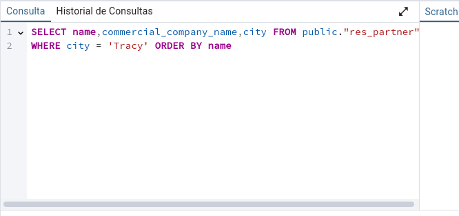
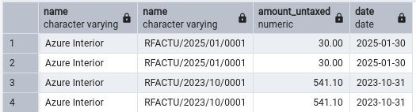

# ODOO - TAREA BBDD
*Esteban Miguel montes Adraz* - *2 DAM* - *SXE*

## APARTADO 1 :smile:
**Enunciado**  :point_down:

Como mencionamos en clase, aunque no es recomendable, en ocasiones puede ser
necesario crear tablas ajenas a Odoo dentro de su base de datos (integración con
sistemas externos, almacenamiento de históricos, datos temporales…). Mediante la
herramienta PgAdmin u otro método que estimes oportuno, elabora y ejecuta una
sentencia que cree una tabla llamada “EmpresasFCT“con los siguientes campos:
- **idEmpresa**: autonumérico. Este campo será la clave primaria.
- **nombre**: Texto con tamaño máximo de 40 caracteres.
- **quiereAlumnos**: Booleano.
- **numAlumnos**: número entero.
- **fechaContacto**: tipo fecha
--- 

Para hacer este apartado, primero entramos a PGAdmin y seleccionamos nuestra base de datos, en este caso su nombre es ```OdooDB```. Una vez seleccionada la base, le damos click al apartado llamado ```Esquemas``` y luego al desplegable llamado ```Tablas```. A esta última le daremos click derecho y nos saldrá esto:


Aquí seleccionaremos la opción ```Crear``` y le daremos a ```Tabla...```. Nos saldrá una ventana emergente en la que pondremos el nombre de la tabla, en este caso ```EmpresasFCT```. Una vez hecho esto, le daremos a la pestaña ```Columnas``` e introduciremos la siguiente información:


Para añadir una columna nueva tenemos que darle al ```+``` que está en la parte superior derecha de la ventana. Una vez añadidas todas las columnas, le daremos a ```Guardar``` y ya tendremos nuestra tabla creada.

## APARTADO 2 :neutral_face:
**Enunciado** :point_down:

Inserta 5 registros inventados en la tabla a través de una sentencia SQL.

---

Haremos click en el apartado que pone ```Herramientas de consulta```, que está en la esquina superior izquierda

.

Al darle click vamos a añadirle las siguientes columnas de la siguiente manera:


## APARTADO 3 :clown_face:

**Enunciado** :point_down:

Realiza una consulta donde se muestren todos los datos de la tabla EmpresasFCT
ordenados por fechaContacto, de modo que en la primera fila salga el que tenga la
fecha más reciente.

---

Para hacer esta consulta, como en el apartado anterior,
le damos a ```Herramienta de consulta``` y añadimos la siguiente línea de consulta
```SQL
SELECT * FROM public."EmpresasFCT"
```

Lo ponemos como en la imagen y le damos a ```Execute Script```


Como resultado nos tendría que salir todo lo que haya en el la tabla de
EmpresasFCT


## APARTADO 4 :stuck_out_tongue_closed_eyes:
**Enunciado** :point_down:

Realiza una consulta que permita obtener un listado de todos los contactos de
Odoo (no empresas) con la siguiente información:
- Nombre
- Cuya ciudad sea Tracy
- Nombre comercial de la empresa
ordenados alfabéticamente por el nombre comercial de la empresa.
 
---

En herrmientas de consulta pondremos la siguiente consulta
```SQL
SELECT name,commercial_company_name,city FROM public."res_partner"
WHERE city = 'Tracy'
```


Nos tendrá que salir de resultado la siguiente tabla


## APARTADO 5 :scream:
**Enunciado** :point_down:
Utilizando las tablas de odoo, obtén un listado de empresas proveedoras, que han
emitido algún reembolso (facturas rectificativas de proveedor)
- Nombre de la empresa
- Número de factura
- Fecha de la factura
- Total factura SIN impuestos
Ordenadas por fecha de factura de modo que la primera sea la más reciente.

---

Haremos esta consulta:
```SQL
SELECT res_partner.name,account_move.name, account_move.amount_untaxed, account_move.date
FROM account_move 
JOIN res_partner 
ON account_move.partner_id = res_partner.id
WHERE account_move.move_type = 'in_refund'
ORDER BY account_move.invoice_date DESC;
```
Y nos dará como resultado la siguiente tabla


## APARTADO 6 :sunglasses:
**Enunciado** :point_down:
Utilizando las tablas de odoo, obtén un listado de empresas clientes, a las que se les
ha emitido más de dos facturas de venta (solo venta) confirmadas, mostrando los
siguientes datos:
- Nombre de la empresa
- Número de facturas
- Total facturado SIN IMPUESTOS

---

Para resolver este ejercicio, pondremos la siguiente consulta:
```SQL
SELECT 
    res_partner.name,
    COUNT(account_move.id),
    SUM(account_move.amount_untaxed)
FROM account_move
JOIN res_partner ON account_move.partner_id = res_partner.id
WHERE account_move.move_type = 'out_invoice' 
AND account_move.state = 'posted'  
GROUP BY res_partner.name
HAVING COUNT(account_move.id) > 2  
ORDER BY SUM(account_move.amount_untaxed) DESC;
```

Y nos dará como resultado la siguiente tabla


## APARTADO 7 :open_mouth:
**Enunciado** :point_down:
Crea una sentencia que actualice el correo de los contactos cuyo dominio es
@bilbao.example.com a @bilbao.bizkaia.neus

---

Pondremos esta consulta:
```SQL
UPDATE res_partner 
SET email = replace("email", '@bilbao.example.com', '@bilbao.bizkaia.eus')
WHERE email = '%@bilbao.example.com'
```

Así es como se vería antes de hacer el ```UPDATE```


Así es como se vería después de hacer el ```UPDATE```


## APARTADO 8 :kissing_smiling_eyes:
**Enunciado** :point_down:

La empresa Ready Mat ha hecho un ERE y ha despedido a todos los empleados
que tenías como contacto. Crea una sentencia que elimine todos los contactos
pertenecientes a la empresa “Ready Mat”, pero mantén la empresa. Añade una
captura de pantalla de la sección de contactos de odoo con Ready Mat antes y
después.

---

Para hacer este apartado, vamos utilizar la instrucción ```DELETE```. Pondremos la siguiente consulta:
```SQL
DELETE FROM res_partner
WHERE commercial_company_name = 'Ready Mat'
AND is_company = false
```

Aquí podemos ver como es antes de hacer el ```DELETE```


Aquí podemos ver como es después de hacer el ```DELETE```


Y hasta aquí la tarea de BBDD, espero que haya quedado todo bien explicado y que se haya entendido todo. :smile: